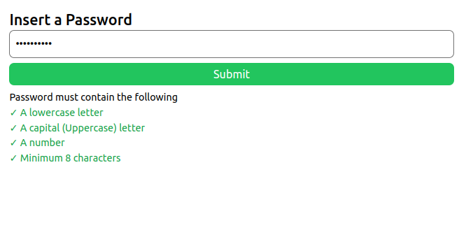

# Problema 5

El siguente es un sitio web que solicita que el usuario ingrese una contraseña, y esta es evaluada con los siguientes criterios: debe ser mayor de 8 caracteres, tener mayusculas, minusculas y al menos un numero

La aplicacion esta hecha con React y TailwindCSS

## Instalaciom

1. Con una terminal, situese en la carpeta raiz del proyecto
2. Instale los modulos con `npm install`
3. Use `npm run dev` para ejecutar el servidor de desarrollo e ingrese al puerto que se le indique el su terminal con cualquier navegador

## Screenshots

