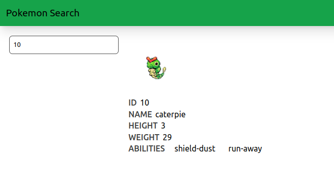

# Problema 6
El siguente es un sitio web que busca informacion de pokemons, unsando una API para Pokemon, se puede buscar por numero de ID o nombre

La aplicacion esta hecha con Vue y TailwindCSS

## Instalaciom

1. Con una terminal, situese en la carpeta raiz del proyecto
2. Instale los modulos con `npm install`
3. Use `npm run dev` para ejecutar el servidor de desarrollo e ingrese al puerto que se le indique el su terminal con cualquier navegador

## Screenshots

